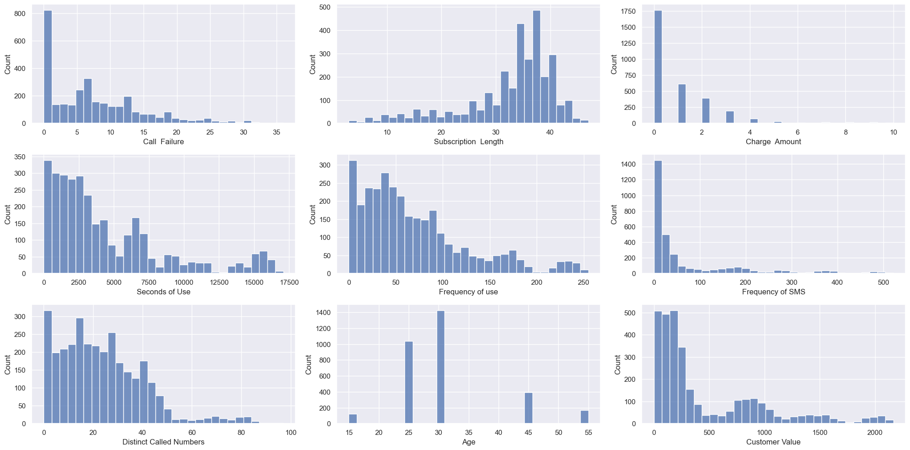
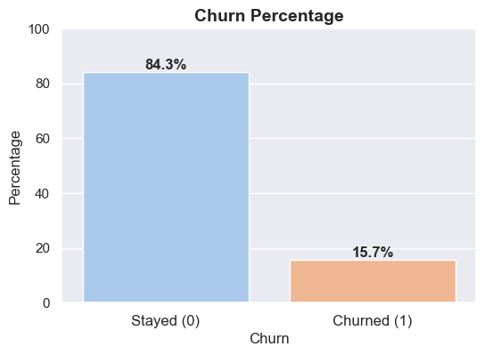
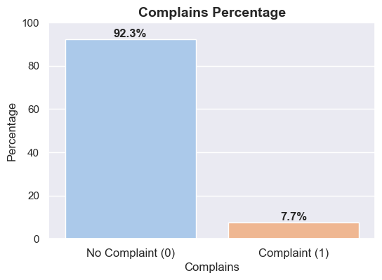
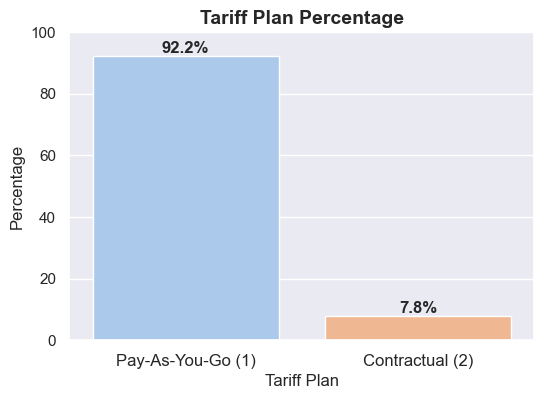
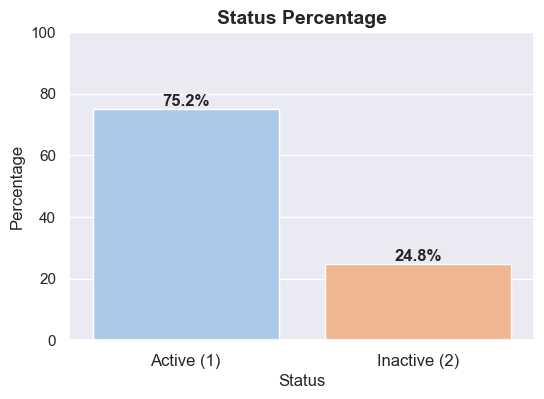
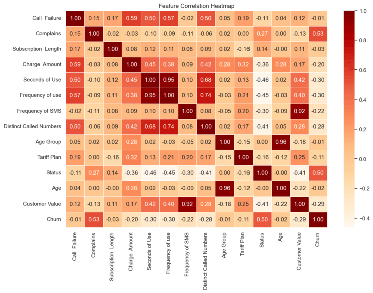
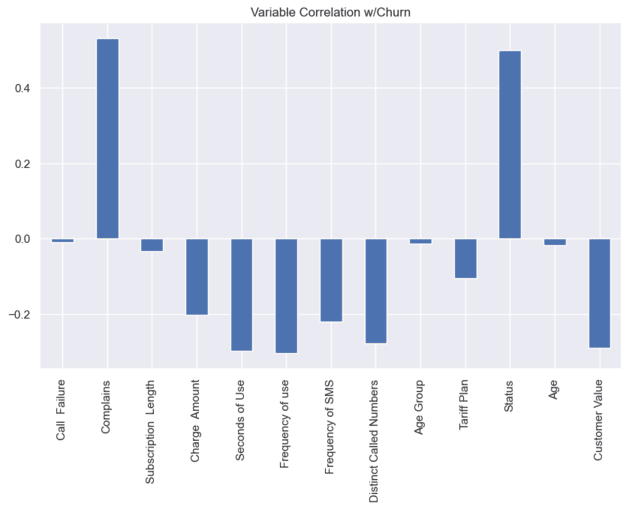
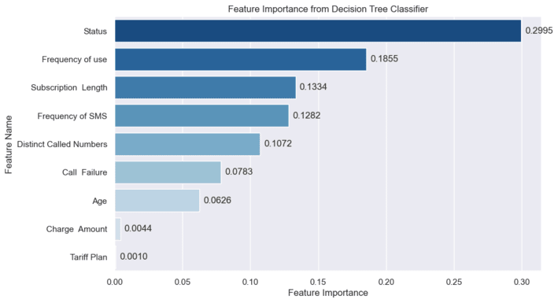
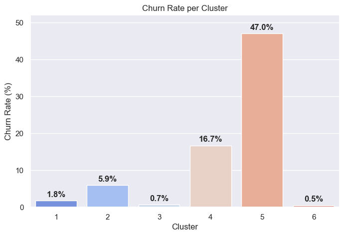

# Telecoms Churn Analysis
### 📍 Overview 
In this project I build a predictive churn model for a Telecommunications company using Python and give relevant business recommendations.

#### <ins>Problem Statement<ins>

Retaining existing customers is more cost-effective than acquiring new ones. With this project my aim is to provide insights that help with customer retention efforts by:
- Understanding churn drivers
- Building a predictive model with Decision-Tree-Classifier
- Offering actionable insights to key stakeholders
### 📖 Context 
#### <ins>Churn<ins>
Churn or churn rate according to Investopedia is the "**rate at which customers stop doing business with an entity.**" Understanding how churn affects your business is crucial. Good customer retention strategy starts with understanding: 
- Why customers are leaving
- Which types of customers are leaving
- And at what rate they're leaving

To drive the point further, without a thorough understanding of KPI metrics like Churn Rate you are effectively flying blind. Strategic insights provided via data are the eyes and ears of a business. It only becomes possible to solve and understand a problem by becoming aware of its existance and depth. Current machine learning models provide us useful tools that help us in this endeavor.

#### <ins>Data<ins>

The dataset I use comes from an Iranian telecommunications company and was donated to the [UC Irvine Machine Learning Repository](https://archive.ics.uci.edu/dataset/563/iranian+churn+dataset). It contains information for 3,150 customers across a period of 12 months. The dataset features 14 columns:

1) **Call Failure** - # of call failures
2) **Complains** - complaint (1) or no complaint (0)
3) **Subscription Length** - total months of subscription
4) **Charge Amount** - lowest to highest amount (0-9) 
5) **Seconds of Use** - total seconds of calls
6) **Frequency of Use** - total # of calls
7) **Frequency of SMS** - total # of text messages
8) **Distinct Called Numbers** - total # of distinct phone calls
9) **Age Group** - younger to older age (1-5) 
10) **Tariff Plan** - pay-as-you-go (1) or contractual (2)
11) **Status** - active (1) or inactive (2)
12) **Age** - age of customer
13) **Customer Value** - calculated value of customer
14) **Churn** - whether or not the customer churned in the 9-12 month period (1: churned, 0: remained)

### 🔎 Exploratory Data Analysis (EDA) 
#### <ins>Descriptive Statistics<ins>
|       | Call Failure | Subscription Length | Charge Amount | Seconds of Use | Frequency of Use | Frequency of SMS | Distinct Called Numbers | Age  | Customer Value |
|---------------|-------------|---------------------|---------------|----------------|------------------|------------------|------------------------|------|----------------|
| **Count**     | 3150        | 3150                | 3150          | 3150           | 3150             | 3150             | 3150                   | 3150 | 3150           |
| **Mean**      | 7.63        | 32.54               | 0.94          | 4472.46        | 69.46            | 73.17            | 23.51                   | 30.99 | 470.97         |
| **Std**   | 7.26        | 8.57                | 1.52          | 4197.91        | 57.41            | 112.24           | 17.22                   | 8.83  | 517.02         |
| **Min**       | 0           | 3                   | 0             | 0              | 0                | 0                | 0                        | 15   | 0              |
| **25%**       | 1           | 30                  | 0             | 1391.25        | 27               | 10               | 10                       | 25   | 113.80         |
| **50%** | 6        | 35                  | 0             | 2990           | 54               | 21               | 21                       | 30   | 228.48         |
| **75%**       | 12          | 38                  | 1             | 6478.25        | 100              | 87               | 34                       | 34   | 788.39         |
| **Max**       | 36          | 47                  | 10            | 17090          | 255              | 522              | 97                       | 55   | 2165.28        |
- There are customers with 0 seconds-of-use/frequency-of-use. This could potentially point to customers facing technical issues trying to connect. If we tracked customers with 0 seconds of use their churn rate would most likely be high.
- Would be interesting to see what level of call failure customers are more likely to churn at.
#### <ins>Univariate Analysis<ins>

- Majority of customers experience relatively low call failure.
- Frequency-of-use and Seconds-of-use have a very similar distribution. 
- Age data is pretty odd. Only recorded ages are 15, 25, 30, 45, and 55.

- We have an imbalanced target (Churn). One might think to utilize resampling techniques. However, in our case this would be a mistake because we need to be prioritizing interpretability, understanding the key drivers of churn, over pure model optimization.
- Compared to the [U.S. telecommunications industry average churn rate of 21%](https://www.statista.com/statistics/816735/customer-churn-rate-by-industry-us/?__sso_cookie_checker=failed) this company is performing better at 15.7%.   

- No Complaint - 2,909 (92.3%)
- Complaint - 241 (7.7%)

- Pay-As-You-Go - 2,905 (92.2%)
- Contractual - 245 (7.8%)

- Active - 2,368 (75.2%)
- Inactive - 782 (24.8%)
#### <ins>Multivariate Analysis<ins>

- Churn is the most correlated with Status and Complains at r=0.5 and r=0.53 respectively.
- As expected Frequency-of-use and Seconds-of-use are highly correlated at r=0.95.
- Age and Age Group is highly correlated at r=0.96.
- Interestingly, Frequency-of-SMS and Customer Value are highly correlated at r=0.92.

### 🤠 Data Wrangling 
#### <ins>Feature Removal<ins>
- Customer Value
    - There is no explanation provided in the dataset's information on what Customer value is and how it was calculated. Doesn't help with interpretability in this scenario.
    - Highly correlated with Frequency-of-SMS and we want to avoid multicollinearity. 
- Age Group
    - Highly correlated with Age and it provides less precise information than Age. 
- Seconds of Use
    - Highly correlated with Frequency-of-Use. Although this gives us duration of call information, I feel that # of calls placed is more relavant for our analysis. 
- Complains
    - Complains helps the model predict because if a customer has complained than its only natural that they are more likely to churn but it doesn't help us learn anything new about why they are churning (giving the model an easy out). By dropping Complains we force the model to find the underlying reasons as to why churn occurs.

### 🌲 Machine Learning Model - Decision Tree
I decided to use Decision Tree learning for this dataset because the algorithm excels at classification while also having high interpretability unlike black-box models like neural-network. Since the goal is prioritizing insights into the **why** rather than pure predicting power this choice is apt. 

#### <ins>Initial Results<ins>
**Classification Report & Accuracy**:
| Class          | Precision | Recall | F1-score | Support |
|---------------|-----------|--------|----------|---------|
| **Stayed (0)**  | 0.96      | 0.95   | 0.96     | 810     |
| **Churned (1)** | 0.72      | 0.78   | 0.75     | 135     |

| Accuracy |
|----------|
| **0.93** |

#### <ins>Hyperparameter Tuning<ins>
After testing different values/options with `max_depth`, `ccp_alpha`, `splitter`, and other parameters I found that setting `max_depth=12` brought the best improvement in performance. 
#### <ins>Post-tuning Results<ins>
**Classification Report & Accuracy**:
| Class          | Precision | Recall | F1-score | Support |
|---------------|-----------|--------|----------|---------|
| **Stayed (0)**  | 0.97      | 0.95   | 0.96     | 810     |
| **Churned (1)** | 0.72      | 0.80   | 0.76     | 135     |

| Accuracy |
|----------|
| **0.93** |

#### <ins>Classification Tree<ins>

### 💼 Results & Reccomendations
#### <ins>Feature Importance<ins>

The top 7 features ranked in order of importance by our Decision Tree model are:
1. Status
2. Frequency of Use
3. Subscription Length
4. Frequency of SMS
5. Distinct Called Numbers
6. Call Failure
7. Age

#### <ins>K-Means Clustering<ins>
K-Means Clustering can help us segment customers based on the top 7 features. 

| Cluster | Status (Avg) | Frequency of use (Avg) | Subscription Length (Avg) | Frequency of SMS (Avg) | Distinct Called Numbers (Avg) | Call Failure (Avg) | Age (Avg)  | Count |
|--------------|--------|------------------|----------------------|------------------|-------------------------|-------------|------|---------------|
| 1            | 1.00   | 82.81            | 31.12                | 26.30            | 33.83                   | 8.83        | 49.29 | 396           |
| 2            | 1.00   | 77.29            | 36.05                | 35.32            | 25.11                   | 6.42        | 26.43 | 860           |
| 3            | 1.00   | 183.80           | 34.18                | 67.31            | 47.96                   | 19.48       | 27.18 | 305           |
| 4            | 1.00   | 37.20            | 16.72                | 66.81            | 13.64                   | 4.40        | 27.66 | 401           |
| 5            | 2.00   | 23.97            | 34.74                | 15.28            | 11.08                   | 6.15        | 30.98 | 778           |
| 6            | 1.00   | 72.96            | 36.65                | 318.30           | 25.23                   | 6.16        | 29.06 | 410           |
