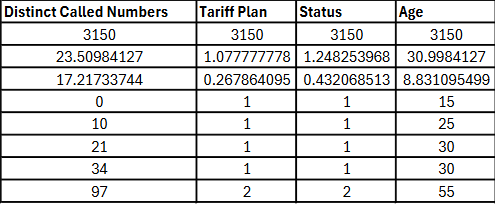

# Telecoms Churn Analysis + Dashboard
### 📍 Overview 
In this project I build a predictive churn model for a Telecommunications company using Python and create an interactive Tableau dashboard for intuitive insights.
### 📖 Context 
#### <ins>Churn<ins>
Churn or churn rate according to Investopedia is the "**rate at which customers stop doing business with an entity.**" Understanding how churn affects your business is crucial. Good customer retention strategy starts with understanding: 
- Why customers are leaving
- Which types of customers are leaving
- And at what rate they're leaving

To drive the point further, without a thorough understanding of KPI metrics like Churn Rate you are effectively flying blind. Strategic insights provided via data are the eyes and ears of a business. It only becomes possible to solve and understand a problem by becoming aware of its existance and depth. Current machine learning models provide us useful tools that help us in this endeavor.

#### <ins>Data<ins>

The dataset I use comes from an Iranian telecommunications company and was donated to the [UC Irvine Machine Learning Repository](https://archive.ics.uci.edu/dataset/563/iranian+churn+dataset). It contains information for 3,150 customers across a period of 12 months. The dataset features 14 columns:

1) **Call Failure** - # of call failures
2) **Complains** - complaint (1) or no complaint (0)
3) **Subscription Length** - total months of subscription
4) **Charge Amount** - lowest to highest amount (0-9) 
5) **Seconds of Use** - total seconds of calls
6) **Frequency of Use** - total # of calls
7) **Frequency of SMS** - total # of text messages
8) **Distinct Called Numbers** - total # of distinct phone calls
9) **Age Group** - younger to older age (1-5) 
10) **Tariff Plan** - pay-as-you-go (1) or contractual (2)
11) **Status** - active (1) or inactive (2)
12) **Age** - age of customer
13) **Customer Value** - calculated value of customer
14) **Churn** - whether or not the customer churned in the 9-12 month period (1: churned, 0: remained)

#### <ins>Problem Statement<ins>

Retaining existing customers is more cost-effective than acquiring new ones. With this project my aim is to provide insights that help with customer retention efforts by:
- Understanding churn drivers
- Building a predictive model
- Visualizing insights for business decisions

### 🔎 Exploratory Data Analysis (EDA) 
#### <ins>Descriptive Statistics<ins>

#### <ins>Univariate Analysis<ins>

#### <ins>Multivariate Analysis<ins>

